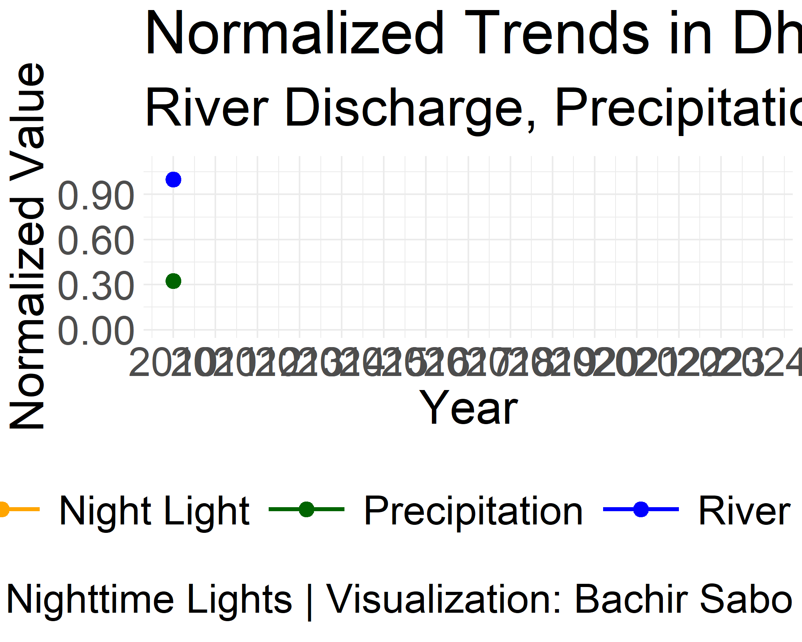

# Assessing Urban Flood Risk in Dhaka, Bangladesh Using Data Analytics

## Introduction

Urban flooding is a significant challenge in many South Asian cities, with Dhaka, Bangladesh, being one of the most affected due to its low elevation, high population density, and inadequate drainage infrastructure. Climate change exacerbates this issue by increasing the frequency and intensity of heavy rainfall events. This project aims to demonstrate how data analytics can help assess flood risk in Dhaka and provide actionable insights for infrastructure resilience and policy planning.

## Problem Statement

- **Increased Flood Frequency**: Dhaka experiences frequent urban flooding, disrupting daily life and causing economic losses.
- **Infrastructure Vulnerability**: Aging and insufficient drainage systems fail to cope with heavy rainfall.
- **Need for Data-Driven Insights**: Analytical approaches are necessary to identify high-risk areas and inform policy decisions.

## Data Collection and Sources

- **Rainfall Data**:
  - Source: [Bangladesh Meteorological Department (BMD)](http://www.bmd.gov.bd) or [CHIRPS](https://data.chc.ucsb.edu/products/CHIRPS-2.0/)
  - Description: Historical daily rainfall data for Dhaka over the past 20 years.

- **Elevation Data**:
  - Source: [Shuttle Radar Topography Mission (SRTM)](https://www2.jpl.nasa.gov/srtm/)
  - Description: High-resolution Digital Elevation Model (DEM) of Dhaka.

- **Land Use Data**:
  - Source: [OpenStreetMap](https://www.openstreetmap.org)
  - Description: Land cover and land use classifications within Dhaka.

- **Drainage Infrastructure Data**:
  - Source: Dhaka Water Supply and Sewerage Authority (DWASA) reports or spatial data.
  - Description: Locations and capacities of drainage networks.

- **Population Data**:
  - Source: [Bangladesh Bureau of Statistics](http://www.bbs.gov.bd)
  - Description: Population density maps of Dhaka.

- **INFORM Risk Index  Data**:
  - Source: [INFORM Sub-national Risk Index for Bangladesh 2022](https://drmkc.jrc.ec.europa.eu/inform-index/INFORM-Subnational-Risk/Bangladesh)
  - Description: Risk data (flood, earthquake, storms...) at the Upazila level in Bangladesh.

- **VIIRS Nighttime Lights Data**:
  - Source: [VIIRS Nighttime Lights](https://geo.aiddata.org/#!/)
  - Description: Nighttime lights data for Dhaka.

- **API Data Sources**:
  - [Open-Meteo API: Temperature, humidity, and rainfall data](https://open-meteo.com/en/docs#latitude=23.7104&longitude=90.4074) European Centre for Medium-Range Weather Forecasts (ECMWF)
  - [Flood API: River discharge data](https://open-meteo.com/en/docs/flood-api) CEMS-GloFAS historical dataset
  - [Climate API: Shortwave radiation, pressure, soil moisture, and evapotranspiration data](https://open-meteo.com/en/docs/climate-api) World Data Center for Climate (WDCC), CMIP6 HighResMIP Project, EC-Earth3P-HR model, EC-Earth-Consortium
  - [World Bank Open Data API: GDP data](https://data.worldbank.org/indicator/NY.GDP.MKTP.CD)
  - [Demographic and Health Surveys (DHS) API: Detailed household and health data](https://dhsprogram.com/data/available-datasets.cfm)
  - [WorldClim: High-resolution climate data](https://www.worldclim.org/data/worldclim21.html)
  - MODIS: Environmental and land cover data.

## Analytical Techniques and Tools

- **Software**: R, Python
- **R Libraries**:
  - Data Processing: `dplyr`, `readxl`
  - Geospatial Analysis: `sf`, `ggspatial`
  - Visualization: `ggplot2`, `ggthemes`, `ggtext`, `gganimate`
- **Python Libraries**:
  - Data Processing: `pandas`, `numpy`
  - Geospatial Analysis: `geopandas`, `rasterio`, `gdal`
  - API Data Retrieval: `requests`, `requests_cache`, `retry_requests`, `openmeteo_requests`
  - Visualization: `matplotlib`, `seaborn`

## Project Structure
- `data/`: Contains raw, processed, and external data.
- `notebooks/`: Jupyter notebooks for data analysis, modeling, and visualization.
- `src/`: Source code for data loading, cleaning, modeling, visualization, and policy support.
- `requirements.txt`: Python dependencies.
- `README.md`: Project documentation.

## Installation
1. Install R and RStudio.
2. Install the required R packages:
    ```R
    install.packages(c("sf", "ggplot2", "dplyr", "ggthemes", "readxl", "ggspatial", "ggtext", "gganimate"))
    ```
3. Install Python and the required Python libraries:
    ```bash
    pip install pandas numpy geopandas rasterio gdal requests requests_cache retry_requests openmeteo_requests matplotlib seaborn
    ```

## Usage
1. Clone the repository:
    ```bash
    git clone https://github.com/S-bachir/Assessing-Urban-Flood-Risk-in-Dhaka-Bangladesh.git
    ```
2. Open the R scripts or notebooks in RStudio.
3. Run the Python scripts or notebooks in a Python environment.
4. Explore the data analysis, modeling, and visualization results.

## Results

The project includes the following key visualizations:

1. **City of Dhaka Flood comparaison : 2014 vs 2016**

    

2. **NightTime Lights**: Visualization of VIIRS Nighttime Lights for 2023.

    

3. **Dhaka Normalized Trends**: Visualization of normalized VIIRS Nighttime Lights, Precipitation, and Discharge from 2010 to 2024.

    

## Future Work

- **Incorporate Upstream Data**: Include upstream precipitation and river flow data to account for transboundary water contributions.
- **Higher Resolution Modeling**: Use finer spatial and temporal scales to capture local variations more accurately.


## Contributors

- [Bachir S](https://github.com/S-bachir)


